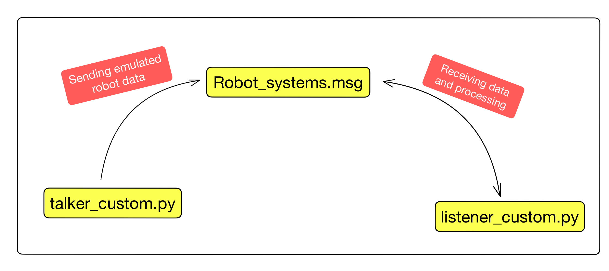
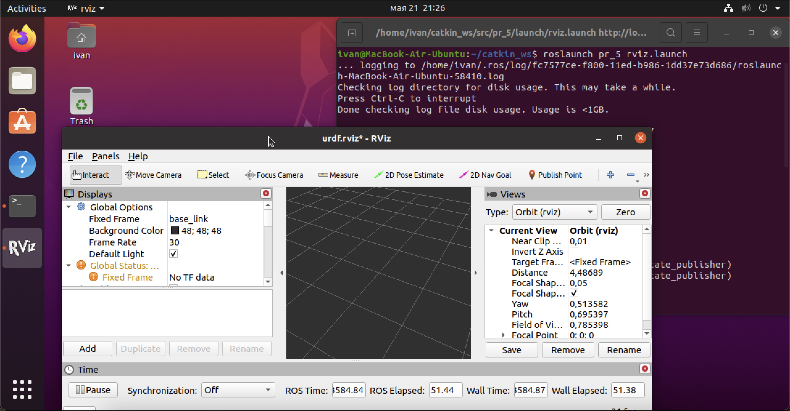
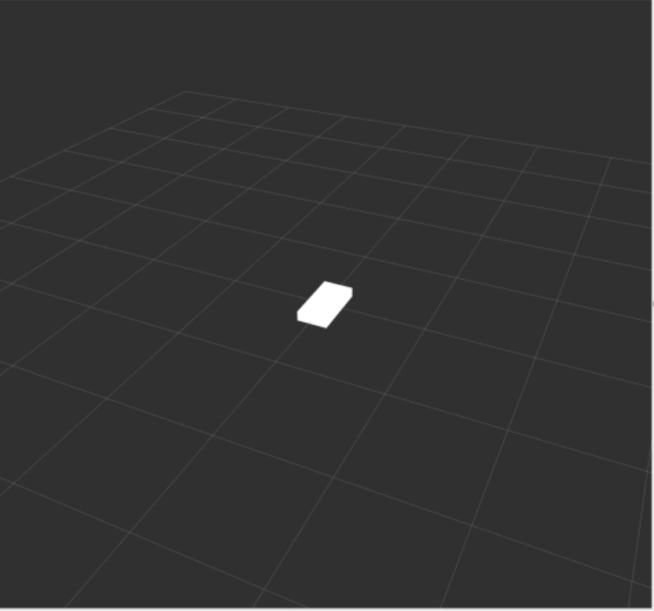

# fluffy-octo-palm-tree

Павлов          0.5

Назаренко       0.1

Голубятников    0.1


Алымова         0.2

Буравцова       0.1  

Aндронова


(* get a closer look *)


  
 # Package overview
 
  Разработанный пакет pr_5 представляет из себя готовую модель для симуляции робота с дифференциальным управлением. Предварительно была установлена операционная система ubuntu 20.04 с помощью фреймворка UTM, далее в ней установлена и запущена система ROS, которая позже была дополнена пакетом для симуляции робота turtlebot3. В функционал последнего входит возможность симуляции движения, управления и отрисовки траектории в 2-х и 3-х мерном пространстве. 

  В ходе работ, на основе алгоритмов, использованых для turtlebot3, была реализована собственная симуляция робота, позволяющая клавишами W-вперёд, A-влево, S-стоп, D-вправо, X-назад, управлять линейной и угловой скоростью платформы.
  
  Система подразумевает общение между двумя узлами через файл-сообщение. 
  


Отсюда видно, что общение происходит между узлами talker и listener. Первый - генерирует сообшение, в котором содержатся угловая и линейная скорости, имитируя робота. Второй получает данные параметры и вычисляет угловые скорости колёс на основании которых строятся показания энкодеров, с помощью котрых вычисляется угол поворота и линейная скорость платформы, преобразуемые в координаты.

### talker
<details>
  <summary>Toggle contents of talker_custom.py </summary>
  
  ```python
  #!/usr/bin/env python3

  import rospy
  from pr_5.msg import Robot_systems
  import sys, select, os
  if os.name == 'nt':
    import msvcrt, time
  else:
    import tty, termios

  def getKey():
      if os.name == 'nt':
          timeout = 0.1
          startTime = time.time()
          while(1):
              if msvcrt.kbhit():
                  if sys.version_info[0] >= 3:
                      return msvcrt.getch().decode()
                  else:
                      return msvcrt.getch()
              elif time.time() - startTime > timeout:
                  return ''

      tty.setraw(sys.stdin.fileno())
      rlist, _, _ = select.select([sys.stdin], [], [], 0.1)
      if rlist:
          key = sys.stdin.read(1)
      else:
          key = ''

      termios.tcsetattr(sys.stdin, termios.TCSADRAIN, settings)
      return key

  def talker():

      target_linear_vel   = 0.0
      target_angular_vel  = 0.0
      control_linear_vel  = 0.0
      control_angular_vel = 0.0

      pub = rospy.Publisher('custom_chatter', Robot_systems)
      rospy.init_node('custom_talker', anonymous=True)
      r = rospy.Rate(10) #10 hz

      while not rospy.is_shutdown():
          key = getKey()
          if key == 'w' :
              control_linear_vel  += 0.1
          elif key == 'x' :
              control_linear_vel  -= 0.1
          elif key == 'a' :
              control_angular_vel  -= 0.1
          elif key == 'd' :
              control_angular_vel  += 0.1
          elif key == ' ' or key == 's' :
              control_linear_vel  = 0.0
              control_angular_vel = 0.0
          else:
              if (key == '\x03'):
                  break

          msg = Robot_systems()
          msg.linear_vel = control_linear_vel
          msg.angular_vel = control_angular_vel
          msg.time = rospy.get_time()

          rospy.loginfo(msg)
          pub.publish(msg)
          r.sleep()

  if __name__ == '__main__':
      if os.name != 'nt':
          settings = termios.tcgetattr(sys.stdin)
      try:
          talker()
      except rospy.ROSInterruptException: pass
  ```
</details>

### listener 
<details>
  <summary>Toggle contents of listener_custom.py </summary>
  
  ```python
  #!/usr/bin/env python

  import rospy
  import math
  from pr_5.msg import Robot_systems

  encr = 0
  encl = 0
  w_lg = 0
  w_rg = 0
  teta_g = 0
  x_g = 0
  y_g = 0
  t_g = 0

  ```
  Функция wspeed() предназначена для вычисления угловой скорости в соответствии с показаниями энкодера. Она принимает угловые скорости левого и правого колёс, вычисляет, сколько прошло с предыдущего измерения. Далее высчитываются изменения показаний каждого из энкодеров, приводящиеся к целочисленным значениям, после чего пересчитываются угловые скорости. А также обновляется глобальное значение времени. Все посчитанные значения обновляются.
  ```python
  
  def wspeed(w_l, w_r):
      global t_g
      N = 4096
      t = float(rospy.get_time())
      dt = t - t_g
      #вычисление показаний энкодера
      dencl = int(w_l * dt * N / (2 * 3.1415))
      dencr = int(w_r * dt * N / (2 * 3.1415))
      #вычисление угловой скорости колеса
      wl = dencl * 2 * 3.1415 / dt / N
      wr = dencr * 2 * 3.1415 / dt / N
      t_g = t
      return dt, wl,wr,  dencl, dencr
  
  ```
  
  Функция funny() предназначена для подсчёта показаний энкодеров, а также координат робота. Она принимает две переменные: линейную и угловую скорости робота, изменяемые с помощью кнопок пользователем. Из полученных величин высчитываются угловые скорости левого и правого колеса. Далее вызывается функция wspeed(), которая возвращает разницу времени между последним показанием и текущим, пересчитанные угловые скорости каждого из колёс, а также изменения показаний энкодеров колёс. Подробнее о функции будет рассказано позже. По изменениям показаний инкодеров вычисляются текущие выдаваемые ими значения. Заново расчитываются угловая и линейная скорость, а также считаются угол поворода и координаты робота x и y. Поскольку времени между измерениями проходит немного, нет необходимости применять интеграл, частые измерения соответствуют в некоторой степени методу трапеции для подсчёта интеграла.
  
  ```python
  def funny(V, W):
      global t_g
      global teta_g
      global x_g
      global y_g
      global t_g
      global encr
      global encl
      global w_rg
      global w_lg
      L = 0.287
      r = 0.033
      #угловые скорости колёс по полученным данным
      wl = (V - 0.5 * L * W) / r
      wr = (V + 0.5 * L * W) / r
      #угловые скорости колёс после сау
      dt, wl,wr, dencl, dencr = wspeed(wl, wr)
      encl += dencl
      encr += dencr
      #посчитанные угловая и линейная скорости
      V = 0.5 * r * (wl + wr)
      W = r * (wr - wl) / L
      teta = W * dt
      x = V * math.cos(teta) * dt
      y = V * math.sin(teta) * dt
      x_g += x
      y_g += y
      teta_g += teta
      return t_g

  def callback(data):
      funny(data.linear_vel, data.angular_vel)
      rospy.loginfo("Encoder_left %0.2f", encl)
      rospy.loginfo("Encoder_right %0.2f", encr)
      rospy.loginfo("Y: %0.2f", y_g)
      rospy.loginfo("X: %0.2f", x_g)

  def listener():
      rospy.init_node('custom_listener', anonymous=True)
      rospy.Subscriber("custom_chatter", Robot_systems, callback)
      t_g = float(rospy.get_time())
      # spin() simply keeps python from exiting until this node is stopped
      rospy.spin()

  if __name__ == '__main__':
      listener()
  ```
</details>

### msg_file
```python
string name
float32 time
float32 linear_vel
float32 angular_vel
```

## Руководство


```
$ cd ~/catkin_ws/src
$ git clone https://github.com/imp-fmle/fluffy-octo-palm-tree)
```
Для начала необходимо перейти в директорию репозитория

```
$ cd ~/catkin_ws
```
Всего нам потребуется 4 терминала: 


1. В первом - необходимо запустить ядро ROS
```
$ roscore
```


В каждом из терминалов выполнить кооманду source
```
$ source ./devel/setup.bash
```
Затем:
```
$ catkin_make
```

2. Во втором - rosrun pr_5 talker_custom.py - запуск узла силмуляции
```
$ rosrun pr_5 talker_custom.py
```

3. В третьем - rosrun pr_5 listener_custom.py - запуск узла получателя-обработчика
```
$ rosrun pr_5 listener_custom.py
```


4. В четвёртом - roslaunch pr_5 rviz.launch - запуск среды визуализации
```
$ roslaunch pr_5 rviz.launch
```

После активации узлов отправителя и получателя, первый начнёт генерировать показания линейной и угловой скоростей, которые, как было орисано выше, можно будет изменять клавишами WASDX 


На основании этих данных узел listener будет вычислять положение побота в пространстве и показания энкодеров.

Визуализацию происходящего можно осуществлять в среде rViz
```
roslaunch pr_5 rviz.launch
```



После старта симуляции можно будет наблюдать за изменением положения робота в пространстве 




# Итог

Имеем: 

1 терминал для управления ядром

2 терминала для контроля узлов симуляции

1 терминал для визуализации происходящего

В ходе работы была установлена операционная система Ubuntu и ROS nomatic, установлен и опробован пакет для симуляции робота turtlebot. На основе данного пакета был написан собственный узел симуляции управляемого движения робота и разработан алгоритм для вычисления текущей позиции робота на основании данных о его угловой и линейной скорости.

